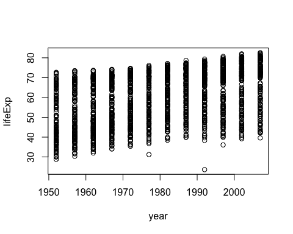
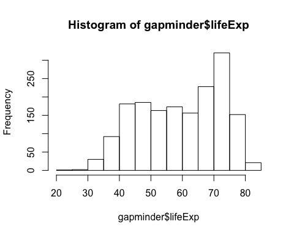
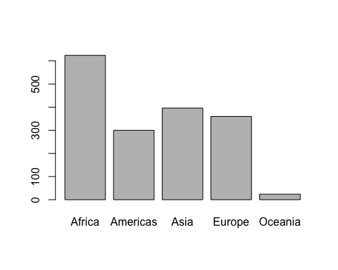
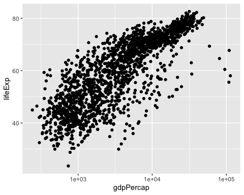
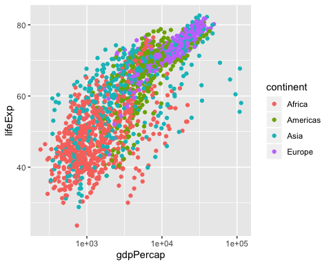
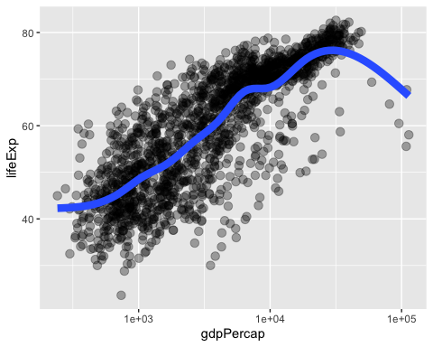
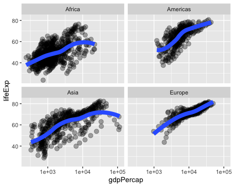

## Chapter 5 R Markdown

This is a practice R Markdown document and used for running chapter 5 examples.  
First, let's start by investigating the power of tidyverse and tibbles.


```r
library(tidyverse)
```

```
## ── Attaching packages ───────────────────────────────────────────────────── tidyverse 1.3.0 ──
```

```
## ✓ ggplot2 3.2.1     ✓ purrr   0.3.3
## ✓ tibble  2.1.3     ✓ dplyr   0.8.3
## ✓ tidyr   1.0.0     ✓ stringr 1.4.0
## ✓ readr   1.3.1     ✓ forcats 0.4.0
```

```
## ── Conflicts ──────────────────────────────────────────────────────── tidyverse_conflicts() ──
## x dplyr::filter() masks stats::filter()
## x dplyr::lag()    masks stats::lag()
```

```r
library(gapminder)
str(gapminder)
```

```
## Classes 'tbl_df', 'tbl' and 'data.frame':	1704 obs. of  6 variables:
##  $ country  : Factor w/ 142 levels "Afghanistan",..: 1 1 1 1 1 1 1 1 1 1 ...
##  $ continent: Factor w/ 5 levels "Africa","Americas",..: 3 3 3 3 3 3 3 3 3 3 ...
##  $ year     : int  1952 1957 1962 1967 1972 1977 1982 1987 1992 1997 ...
##  $ lifeExp  : num  28.8 30.3 32 34 36.1 ...
##  $ pop      : int  8425333 9240934 10267083 11537966 13079460 14880372 12881816 13867957 16317921 22227415 ...
##  $ gdpPercap: num  779 821 853 836 740 ...
```

```r
class(gapminder)
```

```
## [1] "tbl_df"     "tbl"        "data.frame"
```

```r
head(gapminder)
```

```
## # A tibble: 6 x 6
##   country     continent  year lifeExp      pop gdpPercap
##   <fct>       <fct>     <int>   <dbl>    <int>     <dbl>
## 1 Afghanistan Asia       1952    28.8  8425333      779.
## 2 Afghanistan Asia       1957    30.3  9240934      821.
## 3 Afghanistan Asia       1962    32.0 10267083      853.
## 4 Afghanistan Asia       1967    34.0 11537966      836.
## 5 Afghanistan Asia       1972    36.1 13079460      740.
## 6 Afghanistan Asia       1977    38.4 14880372      786.
```

```r
tail(gapminder)
```

```
## # A tibble: 6 x 6
##   country  continent  year lifeExp      pop gdpPercap
##   <fct>    <fct>     <int>   <dbl>    <int>     <dbl>
## 1 Zimbabwe Africa     1982    60.4  7636524      789.
## 2 Zimbabwe Africa     1987    62.4  9216418      706.
## 3 Zimbabwe Africa     1992    60.4 10704340      693.
## 4 Zimbabwe Africa     1997    46.8 11404948      792.
## 5 Zimbabwe Africa     2002    40.0 11926563      672.
## 6 Zimbabwe Africa     2007    43.5 12311143      470.
```

```r
as_tibble(iris)
```

```
## # A tibble: 150 x 5
##    Sepal.Length Sepal.Width Petal.Length Petal.Width Species
##           <dbl>       <dbl>        <dbl>       <dbl> <fct>  
##  1          5.1         3.5          1.4         0.2 setosa 
##  2          4.9         3            1.4         0.2 setosa 
##  3          4.7         3.2          1.3         0.2 setosa 
##  4          4.6         3.1          1.5         0.2 setosa 
##  5          5           3.6          1.4         0.2 setosa 
##  6          5.4         3.9          1.7         0.4 setosa 
##  7          4.6         3.4          1.4         0.3 setosa 
##  8          5           3.4          1.5         0.2 setosa 
##  9          4.4         2.9          1.4         0.2 setosa 
## 10          4.9         3.1          1.5         0.1 setosa 
## # … with 140 more rows
```

```r
names(gapminder)
```

```
## [1] "country"   "continent" "year"      "lifeExp"   "pop"       "gdpPercap"
```

<!-- Note that this type of commenting does NOT show up on your final knit document -->
Note that lenght command returns the number of columns NOT the number of rows

```r
length(gapminder)
```

```
## [1] 6
```

```r
nrow(gapminder)
```

```
## [1] 1704
```

```r
ncol(gapminder)
```

```
## [1] 6
```

```r
dim(gapminder)
```

```
## [1] 1704    6
```

Let's make a plot with base R graphics
<!-- --><!-- -->

Ok, why does the histogram look like it does?

```r
summary(gapminder$year)
```

```
##    Min. 1st Qu.  Median    Mean 3rd Qu.    Max. 
##    1952    1966    1980    1980    1993    2007
```

```r
table(gapminder$year)
```

```
## 
## 1952 1957 1962 1967 1972 1977 1982 1987 1992 1997 2002 2007 
##  142  142  142  142  142  142  142  142  142  142  142  142
```

```r
class(gapminder$year)
```

```
## [1] "integer"
```

So that was an integer.  
What about other variables in the dataset? Let's pick a categorical one.  
*note that this paragraph contains line breaks -which means TWO spaces at the end*  
*Does it look like it in the rendered doc?*  
**Still not for some reason...**

```r
class(gapminder$continent)
```

```
## [1] "factor"
```

```r
summary(gapminder$continent)
```

```
##   Africa Americas     Asia   Europe  Oceania 
##      624      300      396      360       24
```

```r
levels(gapminder$continent)
```

```
## [1] "Africa"   "Americas" "Asia"     "Europe"   "Oceania"
```

```r
nlevels(gapminder$continent)
```

```
## [1] 5
```


```r
barplot(table(gapminder$continent))
```

<!-- -->
Don't forget that R is storing those levels as integers i.e. '1', '2', '3', etc under the hood!!! This will trip up unwary programmers, so don't forget to properly care for your factors. *note that this paragraph was written without line breaks, does it make a difference to the final formatting?*


Here is a much nicer ggplot graph

```r
## we exploit the fact that ggplot was installed and loaded via the tidyverse
p <- ggplot(filter(gapminder, continent != "Oceania"),
            aes(x = gdpPercap, y = lifeExp)) # just initializes
p <- p + scale_x_log10() #log the x axis the right way
p + geom_point() #scatterplot
```

<!-- -->

```r
p + geom_point(aes(color = continent)) #map the continents to color
```

<!-- -->

```r
p + geom_point(alpha = (1/3), size = 3) +
  geom_smooth(lwd = 3, se = F) 
```

```
## `geom_smooth()` using method = 'gam' and formula 'y ~ s(x, bs = "cs")'
```

<!-- -->

```r
p + geom_point(alpha = (1/3), size = 3) + 
  facet_wrap(~continent) +
  geom_smooth(lwd = 3, se = F) 
```

```
## `geom_smooth()` using method = 'loess' and formula 'y ~ x'
```

<!-- -->
That's a wrap for Chapter 5 and practicing with R markdown!!
